# AWS VPC Networking Lab: Windows EC2 Deployment and RDP Access

A hands-on AWS lab demonstrating how to build a custom virtual network, deploy a Windows EC2 instance into a public subnet, restrict remote desktop access to a single source IP, and verify the instance's private network configuration.

## Project overview

I built this lab to understand how VPCs, subnets, internet gateways, route tables, security groups, and EC2 instances work together. The result was a working Windows desktop session reached through RDP, with the server's private IP verified inside the remote session.

**Scope:** A single-instance learning environment configured through the AWS Management Console. This is a foundational networking lab, not a production architecture or a penetration test.

## Environment

| Component | Configuration |
|---|---|
| AWS Region | US East (Ohio), `us-east-2` |
| VPC | `hypertech-vpc` — `10.0.0.0/16` |
| Public subnet | `hypertech-public-subnet` — `10.0.1.0/24` |
| Availability Zone | `us-east-2b` |
| Internet gateway | `hypertech-igw`, attached to the custom VPC |
| Route table | VPC main route table, used by the subnet |
| Public IPv4 assignment | Enabled |
| Security group | `hypertech-rdp-sg` |
| Inbound access | RDP, TCP `3389`, restricted to my public IPv4 address (`/32`) |
| EC2 instance | `hypertech-windows-ec2` |
| Instance type | `t3.micro` |
| Operating system | Microsoft Windows Server |
| Verified private IPv4 | `10.0.1.197` |
| Remote access client | Windows Remote Desktop Connection (`mstsc`) |

The supplied screenshots do not show the selected AMI version, so the operating system is documented without assuming Windows Server 2022 or 2025.

## Build and evidence

### 1. Define the VPC and subnet

Created `hypertech-vpc` with the IPv4 range `10.0.0.0/16`, then created `hypertech-public-subnet` using `10.0.1.0/24`.

The subnet range fits within the VPC range. Availability Zone selection was initially set to **No preference**; AWS placed the subnet in `us-east-2b`.

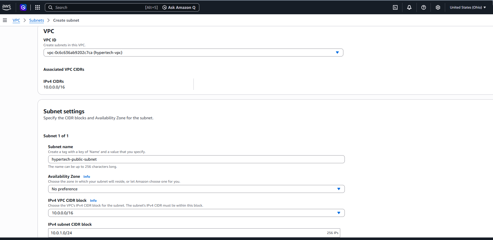

The created subnet reached the **Available** state. A `/24` contains 256 IPv4 addresses; AWS reserves five, leaving 251 assignable addresses before resources are launched.

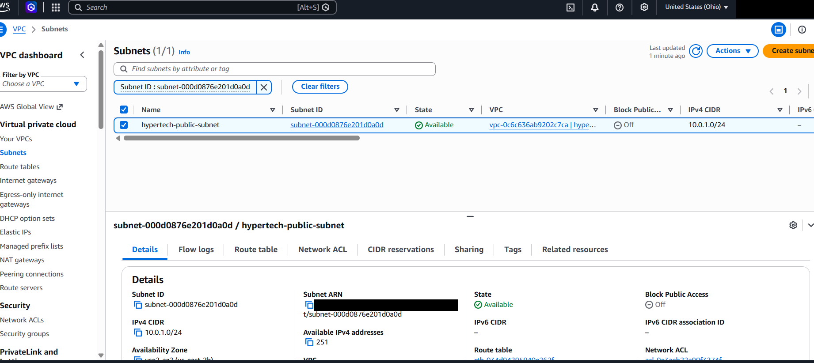

### 2. Attach the internet gateway

Created `hypertech-igw` and attached it to `hypertech-vpc`. The gateway provides the VPC's connection to the internet; attaching it alone does not configure subnet routing.

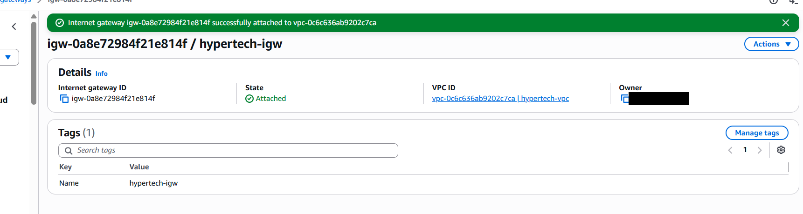

### 3. Configure the subnet's internet route

Edited the VPC's **main route table**, retaining the local route and adding a default IPv4 route to the attached internet gateway.

| Destination | Target | Purpose |
|---|---|---|
| `10.0.0.0/16` | `local` | Routing within the VPC |
| `0.0.0.0/0` | `hypertech-igw` | Default route for other IPv4 destinations |

Both routes show **Active** status. The local route is more specific than the default route, so traffic addressed within the VPC stays on the local route.

The screenshot shows **Main: Yes** and no explicit subnet associations. The subnet uses this table through its implicit main-table association, also confirmed by the subnet details and resource map. Adding the internet gateway route makes this a public subnet.

**Design lesson:** Editing the main table also affects other subnets that inherit it. A future design with private subnets should use a separate public route table and explicit subnet associations.

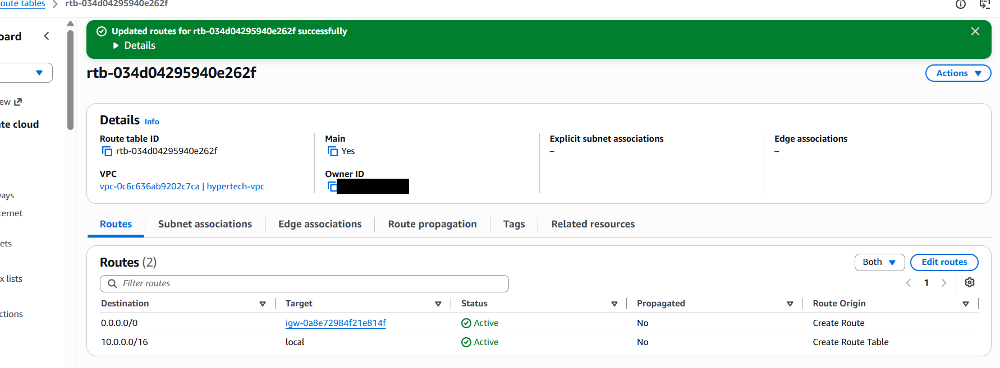

### 4. Enable public IPv4 assignment

Enabled **Auto-assign public IPv4 address** on the subnet. This makes public IPv4 assignment the default for new instances launched there, subject to launch-time settings.

A public IPv4 address enables internet-based addressing, while the private IPv4 address identifies the instance inside the VPC. Routing and security rules must also allow the connection.

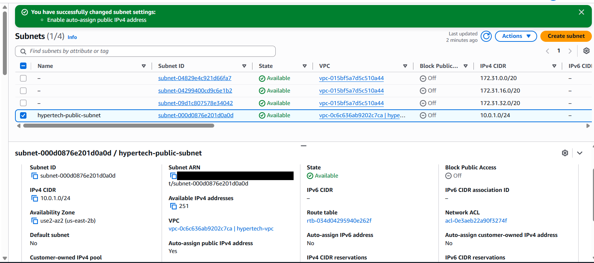

### 5. Restrict RDP with a security group

Created `hypertech-rdp-sg` in the custom VPC with one inbound rule:

| Type | Protocol | Port | Source |
|---|---|---|---|
| RDP | TCP | `3389` | My current public IPv4 address, `/32` |

The `/32` source permits one IPv4 address rather than opening RDP to the entire internet. If my network's public IP changes, this rule must be updated.

The default outbound allow-all rule was retained for the lab. Security groups control permitted traffic; route tables determine where traffic is sent.

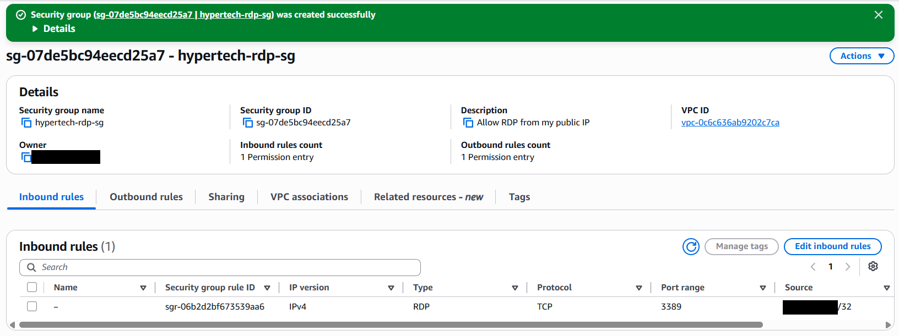

### 6. Launch Windows EC2 in the custom network

Launched `hypertech-windows-ec2` with the following network settings:

- VPC: `hypertech-vpc`
- Subnet: `hypertech-public-subnet`
- Auto-assign public IP: **Enable**
- Existing security group: `hypertech-rdp-sg`

This ensured the instance used the lab network rather than the account's default VPC.

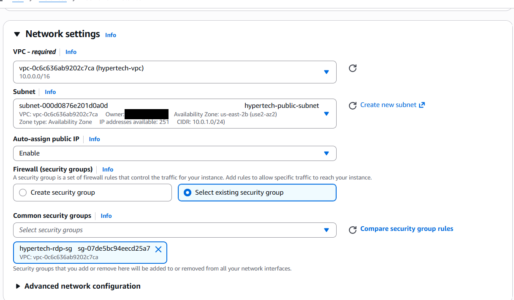

The `t3.micro` instance reached **Running** state with **3/3 status checks passed**. Its EC2 details showed private IPv4 address `10.0.1.197` and an assigned public IPv4 address.

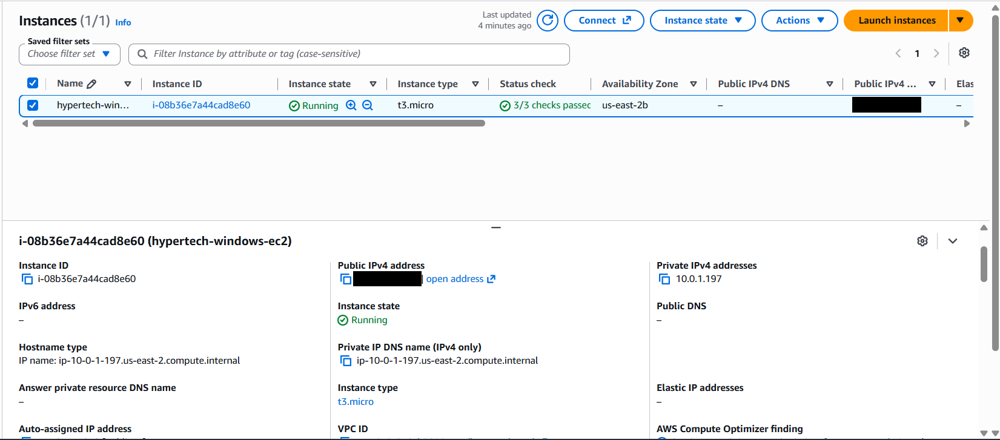

### 7. Establish the RDP session

Retrieved the initial Administrator password through the EC2 **Connect → RDP client** workflow, using the private key associated with the instance.

The downloaded `.rdp` file was blocked by Smart App Control on my laptop. I connected using the built-in Windows client instead:

1. Pressed **Windows + R**.
2. Entered `mstsc`.
3. Entered the instance's public IPv4 address.
4. Signed in with the `Administrator` account and decrypted password.

Smart App Control remained enabled.

The connection displayed a warning that the remote certificate was not from a trusted certifying authority. I checked that I was connecting to the intended EC2 address before proceeding with this lab. An address match alone does not establish trusted certificate identity.

**Evidence note:** Screenshot 09 captures this certificate warning before the desktop session opens. Screenshot 10 below confirms the completed RDP connection.

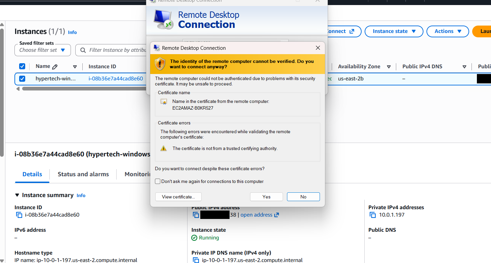

### 8. Verify networking inside the Windows instance

Ran the following command in PowerShell inside the remote Windows desktop:

```powershell
ipconfig
```

| Field | Observed value | Interpretation |
|---|---|---|
| IPv4 address | `10.0.1.197` | Private address inside the configured subnet |
| Subnet mask | `255.255.255.0` | Matches the subnet's `/24` prefix |
| Default gateway | `10.0.1.1` | VPC router address for this subnet |
| DNS suffix | `us-east-2.compute.internal` | AWS internal DNS suffix shown by the instance |

The private address matches the EC2 console. The screenshot also shows the Windows desktop and Remote Desktop Connection window, providing evidence of a successful remote session.

The default gateway `10.0.1.1` is the subnet's router address, not the internet gateway resource itself.

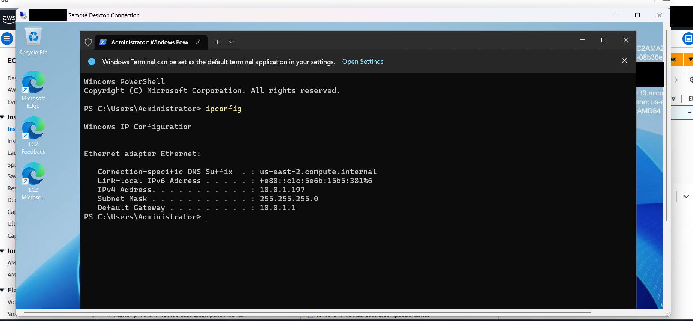

### 9. Review the VPC resource map

Reviewed the resource map to confirm the relationship between the custom VPC, subnet, route table, and internet gateway.

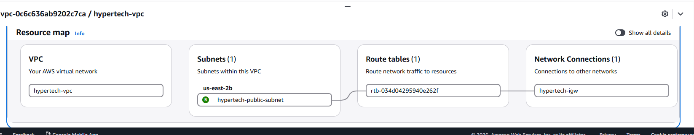

## Verified results

| Validation | Evidence |
|---|---|
| Subnet exists within the custom VPC | Screenshots 01–02 |
| Internet gateway is attached | Screenshot 03 |
| Local and default internet routes are active | Screenshot 04 |
| Public IPv4 assignment is enabled | Screenshots 05 and 07 |
| Inbound RDP is limited to one source IP | Screenshot 06 |
| EC2 is running with 3/3 checks passed | Screenshot 08 |
| Remote Windows desktop is accessible | Screenshot 10 |
| Private IP and subnet mask match the planned subnet | Screenshot 10 |
| Subnet, route table, and gateway are connected | Screenshot 11 |

Successful RDP validates the configured remote-access path. General web browsing, application hosting, failover, and security testing were outside this lab's validation scope.

## Skills demonstrated

- Planning IPv4 CIDR ranges for a VPC and subnet.
- Configuring an internet gateway and default route.
- Understanding implicit main route table associations.
- Applying source-restricted security group rules.
- Deploying Windows EC2 into a custom network.
- Retrieving encrypted Windows credentials with an EC2 key pair.
- Troubleshooting a blocked RDP file using the native client.
- Verifying guest networking with PowerShell.
- Documenting configuration and results with screenshot evidence.

## Security and cost considerations

- RDP access was restricted to a single public IP. The instance still has a public interface; this is a learning setup.
- Private keys, passwords, and AWS credentials must stay out of the repository.
- For public portfolio screenshots, redact account IDs and personal public IP addresses while keeping CIDRs, rule types, and the `/32` restriction visible.
- Disconnecting RDP does not stop EC2. Stop the instance when it is not needed; EBS storage can continue to incur charges.
- EC2, storage, and public IPv4 usage may incur charges depending on account eligibility and usage.
- When the lab is no longer needed, terminate the instance and review remaining volumes and other resources before removing the security group, subnet, gateway, and VPC.

These are operating recommendations; the screenshots do not establish that shutdown or cleanup has already been completed.

## Possible next improvements

- Separate public and private subnets with dedicated route tables.
- Enable VPC Flow Logs to investigate accepted and rejected network traffic.
- Evaluate AWS Systems Manager access to reduce reliance on public RDP.
- Recreate the environment with infrastructure as code.

## Repository layout

Place this `README.md` at the repository root and upload the eleven PNG files into a folder named **`screenshots`**, preserving their exact filenames. All embedded image links use that folder.

## AWS references

- [Create a subnet](https://docs.aws.amazon.com/vpc/latest/userguide/create-subnets.html)
- [Subnet route tables](https://docs.aws.amazon.com/vpc/latest/userguide/subnet-route-tables.html)
- [Security group rules](https://docs.aws.amazon.com/AWSEC2/latest/UserGuide/security-group-rules-reference.html)
- [Get started with EC2](https://docs.aws.amazon.com/AWSEC2/latest/UserGuide/EC2_GetStarted.html)

